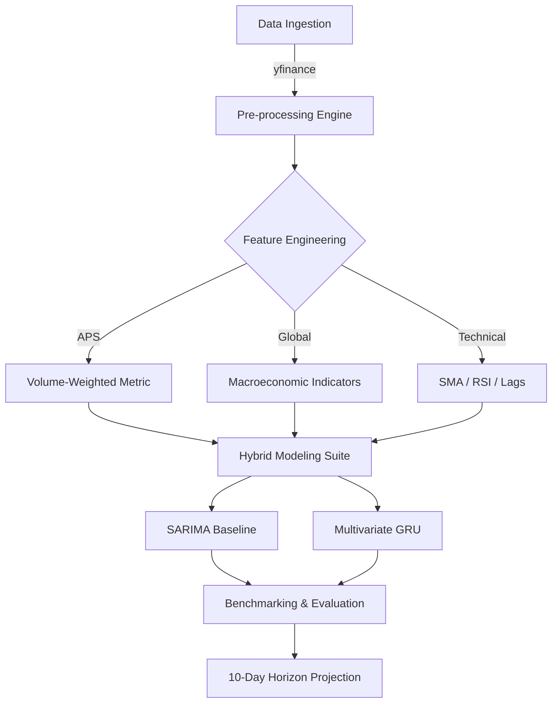

# Nifty 50 IT Sector Forecasting Pipeline

[](https://opensource.org/licenses/MIT)
[](https://www.python.org/downloads/)
[](https://github.com/aniketqxp/stock-timeseries-prediction)

A multivariate time-series analytical framework designed to forecast trend continuations in the Nifty 50 IT sector. This system implements a hybrid architecture combining statistical autoregression (SARIMA) with recursive deep learning (GRU) to model non-linear temporal dependencies across the Indian IT infrastructure.

## System Architecture



## Core Methodology

The pipeline utilizes the **Aggregate Performance Score (APS)** as its primary target variable. The APS is a volume-weighted composite metric that captures the sector-wide valuation density of major constituents (TCS, Infosys, Wipro, HCL Tech, Tech Mahindra).

### Analytical Features
*   **Macroeconomic Integration**: Correlation mapping with Gold futures, USD-INR exchange rates, and S&P 500 benchmarks.
*   **Trend Oscillators**: Automated calculation of 10/20/50-day Moving Averages and Relative Strength Index (RSI).
*   **Recursive Forecasting**: Implementation of multi-step recursive projection for a 10-day temporal window.

## Local Environment Setup

### Prerequisites
*   Python 3.10 or higher
*   pip / venv

### Installation
```bash
# Clone the repository
git clone https://github.com/aniketqxp/stock-timeseries-prediction.git
cd stock-timeseries-prediction

# Initialize virtual environment
python -m venv venv
source venv/bin/scripts/activate  # On Windows: .\venv\Scripts\activate

# Install dependencies
pip install -r requirements.txt
```

## Quick Start Usage

### Pipeline Execution
Run the primary entry point to initiate the end-to-end ingestion, training, and projection sequence:
```bash
python main.py
```

### Research Exploration
For interactive diagnostics and exploratory data analysis (EDA), refer to the project notebook:
```bash
jupyter notebook notebooks/stock_prediction_project.ipynb
```

## Visual Outputs


*Figure 1: Component price profiling across Nifty 50 IT constituents.*


*Figure 2: Observed vs. Projected Horizon (10-Day Recursive Forecast).*
